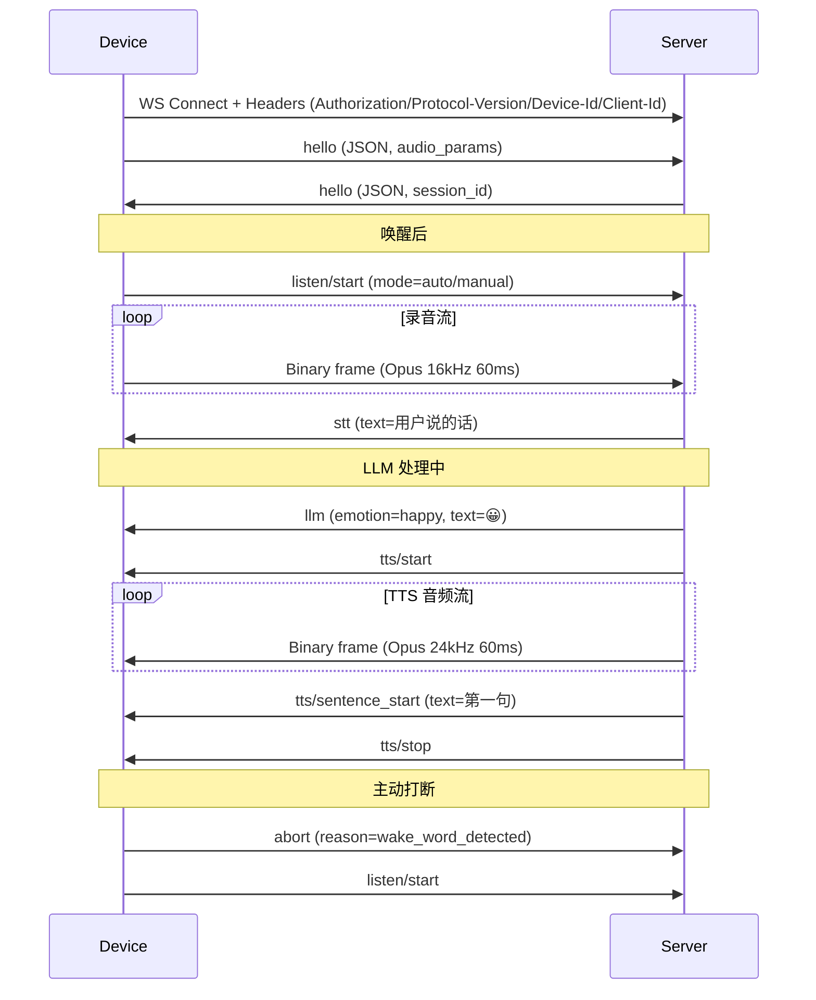
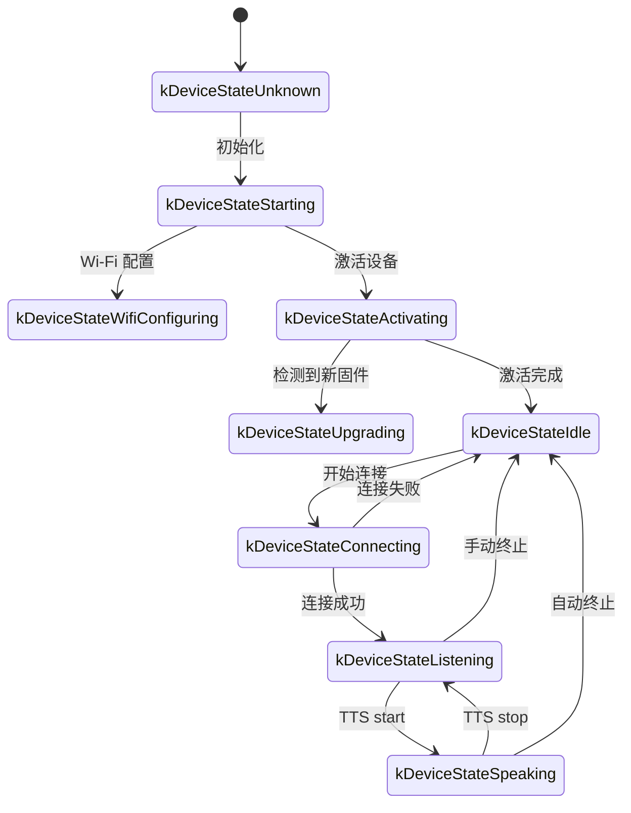

# xiaozhi-esp32 项目调研 (ASR / TTS / 信息流协议)

> **调研时间**: 2026-09
> **目标**: 全面调研 `78/xiaozhi-esp32`（小智 AI 机器人 / 虾哥小智）的语音方案与信息流协议，与我们 p4c5-agent-terminal 项目做对比
> **使用工具**: web_search × 12 次 + web_fetch × 15 次

---

## 1. 项目概览

### 1.1 基本信息
- **GitHub**: [78/xiaozhi-esp32](https://github.com/78/xiaozhi-esp32)
- **副标题**: "An MCP-based Chatbot | 一个基于MCP的聊天机器人"
- **官方服务器**: [xiaozhi.me](https://xiaozhi.me/)
- **License**: MIT
- **维护方**: 深圳十方融海科技有限公司 (华南理工刘思源教授团队合作)

### 1.2 关键数据
| 指标 | 数值 | 来源 |
|------|------|------|
| GitHub Stars | **25K ~ 29.2K** | star-history.com 报道 29.2k；新京报 2026-03 报道 25k |
| 部署设备 | **120 万台+** | 新京报 2026-03-29 报道 |
| 日均对话 | **900 万条** | 新京报 2026-03-29 报道 |
| 日均 Token 处理 | **270 亿** | 新京报 2026-03-29 报道 |
| 接入企业 | 近 **130 家** 中小企业 | 新京报 2026-03-29 报道 |
| 支持芯片平台 | **6 种**: ESP32 / ESP32-C3 / **ESP32-C5** / ESP32-C6 / **ESP32-P4** / ESP32-S3 | 项目 README |
| 支持开发板变体 | **171 个 Release Variants / 138 个 Board 目录** | 项目 README |
| ESP-IDF 目标 | v6.0.2 (主), v5.5.2 (legacy) | 项目 README |
| 主要语言 | C++ (Google C++ style) | 项目 README |

### 1.3 项目定位
> **"作为语音交互入口，小智 AI 聊天机器人利用 Qwen / DeepSeek 等大模型的 AI 能力，通过 MCP 协议实现多终端控制。"**

定位: **AI 硬件开源底座** — 提供从固件、协议、云端服务、IoT 控制全栈开源方案。

### 1.4 上下游生态
**设备端 (ESP32 固件)**:
- 官方: `78/xiaozhi-esp32` (C/C++ ESP-IDF)
- 其他 client: `huangjunsen0406/py-xiaozhi` (Python), `TOM88812/xiaozhi-android-client` (Android), `100askTeam/xiaozhi-linux` (Linux), `78/xiaozhi-sf32` (SiFli 蓝牙芯片), `QuecPython/solution-xiaozhiAI` (QuecPython)

**服务端 (云端大脑)**:
- 官方: `xiaozhi.me` (云服务)
- 开源服务端: `xinnan-tech/xiaozhi-esp32-server` (Python, 6K+ stars), `joey-zhou/xiaozhi-esp32-server-java`, `AnimeAIChat/xiaozhi-server-go`, `hackers365/xiaozhi-esp32-server-golang`

**工具链**:
- `78/xiaozhi-assets-generator` — 自定义资产生成器（唤醒词、字体、表情、背景）
- 华南理工大学主导研发，已被全国 130+ 中小企业采用

---

## 2. ASR 方案详细

### 2.1 设备端：❌ **不做本地 ASR**
小智 ESP32 端 **不运行任何本地 ASR 模型**。设备只做：
1. 麦克风采集 (I2S PCM)
2. **AFE 前端处理** (AEC 回声消除 / NS 噪声抑制 / VAD 语音活动检测)
3. **Opus 编码** 上传云端
4. 云端返回文本 (STT JSON 帧) → 显示到屏幕

源码证据 (`main/audio/audio_service.cc`):
```cpp
esp_opus_enc_config_t opus_enc_cfg = AS_OPUS_ENC_CONFIG();  // 16kHz mono, 60ms
encoder_sample_rate_ = 16000;
encoder_duration_ms_ = OPUS_FRAME_DURATION_MS;  // 60ms
esp_opus_enc_get_frame_size(opus_encoder_, &encoder_frame_size_, &encoder_outbuf_size_);
```

源码证据 (`main/protocols/websocket_protocol.cc`):
```cpp
cJSON_AddStringToObject(audio_params, "format", "opus");
cJSON_AddNumberToObject(audio_params, "sample_rate", 16000);
cJSON_AddNumberToObject(audio_params, "channels", 1);
cJSON_AddNumberToObject(audio_params, "frame_duration", OPUS_FRAME_DURATION_MS);
```

### 2.2 唤醒词方案：✅ **本地 ESP-SR WakeNet**
**实现位置**: `main/audio/engines/afe_audio_engine.cc` (ESP32-S3/P4 使用此引擎)

```cpp
char* wakenet_model_name = esp_srmodel_filter(models_, ESP_WN_PREFIX, nullptr);
// 或 MultiNet (自定义唤醒词):
char* multinet_model_name = esp_srmodel_filter(models_, ESP_MN_PREFIX, nullptr);

afe_config->wakenet_init = wake_detector_ == WakeDetector::kWakeNet;
afe_config->wakenet_model_name = wake_detector_ == WakeDetector::kWakeNet
    ? wakenet_model_name : nullptr;
```

**支持模型** (来自乐鑫 ESP-SR 文档):
| 芯片 | WakeNet 模型 | 说明 |
|------|------------|------|
| **ESP32-S3 / ESP32-P4** | **WakeNet9 / WakeNet9l** | 基于 Dilated Convolution, 支持 "你好小智" 等 |
| **ESP32-C3 / ESP32-C5 / ESP32-C6** | **WakeNet9s** | 压缩版, 内置词: "你好小智 / Hi 乐鑫 / Hi ESP / Hi Jason" |
| ESP32 (经典) | WakeNet5 | 老模型 |

**自定义唤醒词** (CustomWakeWord):
- 基于 MultiNet 引擎 (类似 KWS)
- **仅支持 ESP32-S3 / ESP32-P4 + PSRAM** (其他芯片不能本地自定义)
- 唤醒词建议包含 **3 ~ 6 个音节**
- 工具: `78/xiaozhi-assets-generator` 在线生成

**唤醒后行为** (来自 `main/audio/audio_service.cc`):
```cpp
audio_engine_->OnWakeWordDetected([this](const std::string& wake_word) {
    xEventGroupClearBits(event_group_, AS_EVENT_WAKE_WORD_RUNNING);
    if (callbacks_.on_wake_word_detected) {
        callbacks_.on_wake_word_detected(wake_word);
    }
});
```
设备随后:
1. 停止 WakeNet 检测
2. 开启 AEC (如果有参考通道)
3. 启动录音 (`SendStartListening`) → 打开 WebSocket → 推送 `{"type":"listen","state":"start"}` → 流式上传 Opus

### 2.3 录音格式
| 项目 | 值 |
|------|-----|
| 上行格式 | **Opus** (强制) |
| 上行采样率 | **16 kHz** |
| 上行通道数 | 1 (mono) |
| 上行帧长 | **60 ms** (960 samples @ 16kHz) |
| 上行位深 | 16-bit signed PCM (编码前) |
| 二进制帧 | **裸 Opus WebSocket Binary frame** (协议 v1) |
| 抗回声 | AFE 中 AEC (设备端) + 可选 USE_SERVER_AEC (云端) |

### 2.4 云端 ASR 选项 (`xiaozhi-esp32-server`)

**本地 (免费)**:
- **FunASR** (阿里达摩院, 推荐入门, 需要 2~4 核 CPU + 4~8G 内存)
- **SherpaASR** (k2-fsa/sherpa-onnx, 嵌入式优化)
- **FunASRServer** (调用本地 FunASR HTTP 服务)

**云端 API**:
- **XunfeiStreamASR** (讯飞流式, 推荐流式) — 0.795s 首词
- **DoubaoStreamASRV1/V2** (字节火山流式) — 0.852s / 0.864s 首词
- **AliyunStreamASR** (阿里云流式) — 0.984s 首词
- **Qwen3ASRFlash** (阿里百炼) — 1.023s 首词
- TencentASR / BaiduASR / AliyunASR / DoubaoASR (非流式) — 0.5~1.1s 平均
- OpenAI ASR (Whisper)

**VAD**:
- **Silero VAD** (本地 ONNX, 免费)
- 用法: 16kHz PCM 按 512 samples 切分 → 高低双阈值 + 5 帧窗口(至少 3 帧判定人声) → 1000ms 静音后判定一句话结束
- 非流式 ASR 至少收集 **15 包 (~900ms)** 才提交识别

### 2.5 ASR 性能对比 (来自 [xiaozhi-performance-research](https://github.com/xinnan-tech/xiaozhi-performance-research), 2026-04 测试, 广东联通宽带)
| 模型 | 类型 | 指标 | 值 |
|------|------|------|-----|
| FunASR (本地) | 本地 | 平均处理时间 | **0.071s** |
| XunfeiStreamASR (讯飞流式) | 云端流式 | 平均首词等待 | **0.795s** |
| DoubaoStreamASRV1 (火山) | 云端流式 | 平均首词等待 | 0.852s |
| DoubaoStreamASRV2 (火山) | 云端流式 | 平均首词等待 | 0.864s |
| AliyunStreamASR | 云端流式 | 平均首词等待 | 0.984s |
| Qwen3ASRFlash | 云端流式 | 平均首词等待 | 1.023s |
| TencentASR | 云端非流式 | 平均处理时间 | 0.542s |
| BaiduASR | 云端非流式 | 平均处理时间 | 0.923s |
| AliyunASR | 云端非流式 | 平均处理时间 | 1.114s |
| DoubaoASR | 云端非流式 | 平均处理时间 | 1.071s |

---

## 3. TTS 方案详细

### 3.1 设备端：❌ **不做本地 TTS**
设备只做 **Opus 解码 → PCM → ES8311/I2S → 喇叭**。

源码证据 (`main/audio/audio_service.cc`):
```cpp
esp_opus_dec_cfg_t opus_dec_cfg = OPUS_DEC_CFG(codec->output_sample_rate(), OPUS_FRAME_DURATION_MS);
esp_opus_dec_open(&opus_dec_cfg, sizeof(esp_opus_dec_cfg_t), &opus_decoder_);
decoder_sample_rate_ = codec->output_sample_rate();  // ES8311 输出 24kHz
decoder_duration_ms_ = OPUS_FRAME_DURATION_MS;       // 60ms
decoder_frame_size_ = decoder_sample_rate_ / 1000 * OPUS_FRAME_DURATION_MS;  // 1440 samples
```

### 3.2 下行音频格式
| 项目 | 值 |
|------|-----|
| 下行格式 | **Opus** (强制) |
| 下行采样率 | **24 kHz** (云端编码后) |
| 下行通道数 | 1 (mono) |
| 下行帧长 | **60 ms** (1440 samples @ 24kHz) |
| 二进制帧 | **裸 Opus WebSocket Binary frame** |
| 重采样 | 24kHz → ES8311 实际采样率 (设备端 `esp_ae_rate_cvt_t`) |

### 3.3 云端 TTS 选项 (`xiaozhi-esp32-server`)

**入门全免费配置**:
| 模块 | 推荐 | 备注 |
|------|------|------|
| TTS | **EdgeTTS (微软)** | 免费, 但非流式, 0.667s 平均处理 |

**流式配置 (推荐演示/培训/2+并发)**:
| 模块 | 推荐 | 性能 |
|------|------|------|
| TTS | **HuoshanDoubleStreamTTS (火山引擎豆包双向流式)** | **0.317s 首音** |

**完整 TTS 选项列表**:
| 类型 | 平台 | 性能 (首音) |
|------|------|------------|
| 本地 | PaddleSpeech (本地部署) | **0.103s** ⭐ |
| 云端流式 | XunFeiTTS (讯飞流式) | 0.253s |
| 云端流式 | **IndexStream** | 0.312s |
| 云端流式 | **HuoshanDoubleStreamTTS (火山)** | **0.317s** |
| 云端流式 | Linkerai (灵犀流式) | 0.455s |
| 云端流式 | AliyunStreamTTS (阿里云流式) | 0.712s |
| 云端非流式 | CosyVoiceSiliconflow-Small | 0.103s |
| 云端非流式 | AliyunTTS | 0.322s |
| 云端非流式 | DoubaoTTS (火山) | 0.327s |
| 云端非流式 | TencentTTS | 0.365s |
| 云端非流式 | CosyVoiceSiliconflow | 0.488s |
| 云端非流式 | MinimaxTTSHTTPStream | 0.662s |
| 云端非流式 | EdgeTTS (微软, 免费) | 0.667s |
| 云端非流式 | CozeCnTTS | 0.751s |
| 云端非流式 | TTS302AI | 1.785s |
| 本地 | FishSpeech, GPT_SOVITS_V2/V3, Index-TTS, PaddleSpeech | — |
| 云端 | OpenAI TTS, 灵犀流式, CosyVoiceSiliconflow, 火山引擎, 科大讯飞, 腾讯云, 阿里云/百炼, TTS302AI, CozeCnTTS, GizwitsTTS, ACGNTTS | — |

### 3.4 火山引擎双向流式 TTS 协议细节
来自 EchoPass 实现 ([源码](https://raw.githubusercontent.com/dengyao1/EchoPass/main/echopass/volc_bidirectional_tts.py)), 协议文档: https://www.volcengine.com/docs/6561/1329505

**协议头** (4 bytes):
```
byte[0]: (PROTOCOL_VERSION << 4) | DEFAULT_HEADER_SIZE      // 0x10 | 0x01 = 0x11
byte[1]: (message_type << 4) | message_type_specific_flags
byte[2]: (serialization_method << 4) | message_compression
byte[3]: reserved
```

**消息类型** (message_type):
| 值 | 含义 |
|----|------|
| 0b0001 (1) | FULL_CLIENT_REQUEST |
| 0b1011 (11) | AUDIO_ONLY_RESPONSE |
| 0b1001 (9) | FULL_SERVER_RESPONSE |
| 0b1111 (15) | ERROR_INFORMATION |

**事件类型** (event):
| 值 | 含义 |
|----|------|
| 1 | Start_Connection |
| 2 | FinishConnection |
| 50 | ConnectionStarted |
| 51 | ConnectionFailed |
| 52 | ConnectionFinished |
| 100 | StartSession |
| 101 | CancelSession |
| 102 | FinishSession |
| 150 | SessionStarted |
| 151 | SessionCanceled |
| 152 | SessionFinished |
| 153 | SessionFailed |
| 200 | TaskRequest (文本片段) |
| 350 | TTSSentenceStart |
| 351 | TTSSentenceEnd |
| 352 | TTSResponse (音频帧) |

**关键能力**:
- ✅ **流式输入文本**: 同一会话多次 TaskRequest 推送文本片段 (支持 LLM 流式输出边合成)
- ✅ **流式输出音频**: 服务端边合成边下发 PCM 分片
- ✅ **PCM 24kHz 输出**: 设备无需再解码 MP3
- ✅ **多种音色**: 通过 `speaker` 字段指定

### 3.5 完整端到端流 (来自 xiaozhi-esp32-server 实际代码)
```
LLM 流式输出 chunks → 累积到标点 → 合成这一小句 → 边播放边合成下一句
                                                        ↓
EdgeTTS/HuoshanTTS 产出 MP3/PCM → FFmpeg/Pydub 解码 → 重采样 24kHz PCM → Opus 编码 60ms 包
                                                                              ↓
                                                         AudioRateController (前 5 包立即发送 ≈ 300ms 预缓冲)
                                                                              ↓
                                                                       WebSocket Binary frame
                                                                              ↓
                                                              ESP32: Opus 解码 → ES8311 → 喇叭
```

**AudioRateController** (流式发送控制器):
- 前 5 个 Opus 包立即发送 ≈ 300ms 预缓冲
- 后续包进入 deque
- 按 monotonic clock 每 60ms 发送一个
- `await websocket.send()` 承接底层 socket 流控
- `sentence_start`、音频包、`stop` 消息保持顺序
- 新 `sentence_id` 会重置旧发送任务和队列

### 3.6 设备端 TTS 播放管线 (`main/audio/audio_service.cc`)
```cpp
void AudioService::AudioOutputTask() {
    while (true) {
        std::unique_lock<std::mutex> lock(audio_queue_mutex_);
        audio_queue_cv_.wait(lock, [this]() {
            return !audio_playback_queue_.empty() || service_stopped_.load();
        });
        // ...
        codec_->OutputData(task->pcm);  // PCM → I2S → ES8311 → Speaker
    }
}
```

---

## 4. 信息流协议详细

### 4.1 双传输协议设计
小智提供 **两种传输层**, 设备端配置任选其一:

| 特性 | **WebSocket** (主推) | **MQTT + UDP** (低延迟备选) |
|------|---------------------|----------------------------|
| 控制信道 | WebSocket (TLS 可选) | MQTT (TLS/SSL 8883) |
| 音频信道 | WebSocket Binary | **UDP + AES-CTR 加密** |
| 延迟 | 中等 | 低 |
| 可靠性 | 高 | 中等 |
| 复杂度 | 低 | 高 |
| 加密 | TLS | AES-CTR (key 由 MQTT 分发) |
| 防火墙友好 | 高 | 低 (需放行 UDP) |
| 适用场景 | 家用 Wi-Fi | 4G 模组、低延迟场景 |

> 来源: `docs/mqtt-udp.md` 第 10 节 "Comparison with WebSocket"

### 4.2 WebSocket 协议规范

#### 4.2.1 握手请求头
```
GET /xiaozhi/v1/ HTTP/1.1
Host: api.xiaozhi.me
Upgrade: websocket
Connection: Upgrade
Sec-WebSocket-Key: ...
Sec-WebSocket-Version: 13
Authorization: Bearer <token>
Protocol-Version: 1
Device-Id: <MAC 地址>
Client-Id: <UUID, 擦除 NVS 后重置>
```

#### 4.2.2 Hello 握手 (JSON)
**设备 → 服务器**:
```json
{
  "type": "hello",
  "version": 1,
  "features": {
    "mcp": true,
    "aec": true,
    "glyph_push": true
  },
  "text_font": {
    "bundle": "noto-v1",
    "charset": "common",
    "size": 20,
    "bpp": 4
  },
  "transport": "websocket",
  "audio_params": {
    "format": "opus",
    "sample_rate": 16000,
    "channels": 1,
    "frame_duration": 60
  }
}
```

**服务器 → 设备**:
```json
{
  "type": "hello",
  "transport": "websocket",
  "session_id": "xxx",
  "audio_params": {
    "format": "opus",
    "sample_rate": 24000,
    "channels": 1,
    "frame_duration": 60
  }
}
```

#### 4.2.3 三种二进制协议版本
| 版本 | 头结构 | 用途 |
|------|--------|------|
| **v1 (默认)** | **裸 Opus** (无元数据) | 简化协议, WebSocket 区分 text/binary 帧 |
| v2 | `BinaryProtocol2`: version(2B) + type(2B) + reserved(4B) + timestamp(4B) + payload_size(4B) + payload | **带时间戳**, 用于服务器端 AEC |
| v3 | `BinaryProtocol3`: type(1B) + reserved(1B) + payload_size(2B) + payload | 轻量头 |

**v2 头定义** (用于 server-side AEC, 关键):
```c
struct BinaryProtocol2 {
    uint16_t version;        // 协议版本 (网络字节序)
    uint16_t type;           // 消息类型 (0: OPUS, 1: JSON)
    uint32_t reserved;       // 保留
    uint32_t timestamp;      // 时间戳 (毫秒, 用于服务器端 AEC)
    uint32_t payload_size;   // 负载大小 (字节)
    uint8_t payload[];       // 负载数据
} __attribute__((packed));
```

#### 4.2.4 完整 JSON 消息类型表

**设备 → 服务器** (上行):
| Type | 字段 | 说明 |
|------|------|------|
| `hello` | version, features, audio_params, transport | 握手 |
| `listen` | session_id, state(`start`/`stop`/`detect`), mode(`auto`/`manual`/`realtime`) | 开始/停止录音; `detect`=唤醒词触发 |
| `abort` | session_id, reason(`wake_word_detected`) | 中断当前 TTS |
| `mcp` | session_id, payload (JSON-RPC 2.0) | IoT 控制 (推荐方式) |
| `goodbye` (仅 MQTT+UDP) | session_id | 主动结束会话 |

**服务器 → 设备** (下行):
| Type | 字段 | 说明 |
|------|------|------|
| `hello` | session_id, transport, audio_params | 握手应答 |
| `stt` | session_id, text | ASR 识别结果 |
| `llm` | session_id, emotion, text | LLM 表情/UI 提示 |
| `tts` | session_id, state(`start`/`stop`/`sentence_start`), text | TTS 生命周期 |
| `mcp` | session_id, payload (JSON-RPC 2.0) | 物联网控制 |
| `system` | session_id, command(`reboot`) | 系统控制 |
| `alert` | session_id, status, message, emotion | 告警显示 |
| `custom` | session_id, payload (CONFIG_RECEIVE_CUSTOM_MESSAGE) | 自定义消息 |
| `goodbye` (仅 MQTT+UDP) | session_id | 服务器主动结束 |

**二进制帧** (双向):
- 类型: WebSocket Binary frame
- 内容: Opus 编码音频
- 协议 v1: 裸 Opus (默认)
- 协议 v2: `BinaryProtocol2` 包装 (带 timestamp)
- 协议 v3: `BinaryProtocol3` 包装

### 4.3 消息流示例


### 4.4 MQTT + UDP 协议细节 (备选传输)

#### UDP 音频包结构
```
|type 1B|flags 1B|payload_len 2B|ssrc 4B|timestamp 4B|sequence 4B|
|payload payload_len bytes (AES-CTR 加密)|
```

- **type**: 固定 0x01
- **flags**: 当前未用
- **payload_len**: 网络字节序
- **ssrc**: 同步源标识
- **timestamp**: 网络字节序
- **sequence**: 序列号 (单调递增, 用于抗重放/乱序)
- **payload**: AES-CTR 加密的 Opus 数据
- **AES-CTR**: 128-bit key + 128-bit nonce, counter 由 timestamp + sequence 构造

#### MQTT 主题
- publish_topic: 控制消息主题
- keep_alive: 默认 240s
- 用户名/密码鉴权
- 支持 TLS/SSL (8883)

### 4.5 设备状态机


**设备状态枚举** (`main/device_state.h`):
- `kDeviceStateUnknown`
- `kDeviceStateStarting`
- `kDeviceStateWifiConfiguring`
- `kDeviceStateIdle`
- `kDeviceStateConnecting`
- `kDeviceStateListening`
- `kDeviceStateSpeaking`
- `kDeviceStateUpgrading`
- `kDeviceStateActivating`
- `kDeviceStateAudioTesting` (工厂音频测试)
- `kDeviceStateFatalError`

---

## 5. xiaozhi-esp32 与 p4c5-agent-terminal 对比

### 5.1 硬件平台对比
| 项目 | **xiaozhi-esp32** | **p4c5-agent-terminal (我们)** |
|------|-------------------|-------------------------------|
| 芯片 | ESP32-P4 + ESP32-C5 | **ESP32-P4 + ESP32-C5** ✅ |
| P4/C5 通信 | SDIO (esp-hosted-mcu, C5 作 Wi-Fi slave) | **SDIO (类似方案)** ✅ |
| LCD | 7" 1024×600 MIPI DSI (WTP4C5MP07S 板) | 待定 |
| 麦克风 | INMP441 / ICS43434 (数字麦, 单/双麦常见) | **4 麦 ES7210** (模拟麦阵) |
| 音频 Codec | ES8311 (24kHz 输出) | **ES8311** ✅ + **ES7210** (4 麦 ADC) |
| 功放 | MAX98357A | 待定 |
| 喇叭 | 8Ω 2~3W 或 4Ω 2~3W | 待定 |
| 显示屏 | SSD1306 OLED / 1.8" AMOLED / 7" MIPI | 待定 |
| 4G 模组 | 可选 ML307R / EC801E / NT26 Cat.1 | 待定 |
| 按键 | 音量+/-, BOOT | 待定 |
| 电池 | 支持 (有电量显示) | 待定 |

### 5.2 软件架构对比
| 项目 | **xiaozhi-esp32** | **p4c5-agent-terminal (我们)** |
|------|-------------------|-------------------------------|
| ESP-IDF | v6.0.2 (主), v5.5.2 (legacy) | v5.x |
| 主语言 | C++ (Google style) | C/C++ |
| 项目规模 | 171 个板型 / 大量模块 | 相对精简 |
| 上行音频格式 | **Opus 16kHz mono 60ms** | 待定 (可能 PCM/Opus) |
| 下行音频格式 | **Opus 24kHz mono 60ms** | 待定 |
| 唤醒词 | ✅ **WakeNet9 (ESP-SR, 离线)** + MultiNet 自定义 | ❌ **无** |
| 本地 ASR | ❌ 无 (云端) | ❌ **无** |
| 本地 TTS | ❌ 无 (云端) | ❌ **无** |
| 协议层 | WebSocket JSON / MQTT+UDP | **DSH 协议 (WebSocket JSON-over-WS, 14 下行 + 4 上行帧)** |
| 服务器 | xiaozhi.me (官方) / 自建 (xinnan-tech Python/Java/Go) | **PC Adapter (Mac 端 Node.js)** |
| 鉴权 | Bearer token + Device-Id (MAC) + Client-Id (UUID) | 待定 |
| 音频帧 | 二进制 (Opus raw, v1) / 包装 (v2 带 timestamp, v3 轻量头) | 待定 |
| 客户端 SDK | ESP-IDF 嵌入式 / Python / Android / Linux / SiFli / QuecPython | ESP32 固件 |

### 5.3 核心差异点
| 差异点 | xiaozhi-esp32 | p4c5-agent-terminal |
|--------|---------------|---------------------|
| **定位** | 通用 AI 聊天机器人开源生态 | **专属终端应用** |
| **依赖网络** | 必须联网 (云端 ASR + LLM + TTS) | 由 PC Adapter 决定 (可能本地) |
| **大模型** | 云端 (Qwen / DeepSeek / ChatGLM 等) | 由 PC Adapter 决定 |
| **麦克风** | 1~2 麦 (INMP441) | **4 麦阵列 (ES7210)** ← 优势 |
| **唤醒词** | ✅ ESP-SR WakeNet9 / MultiNet | ❌ 无 (依赖按键触发或 PC Adapter 决策) |
| **AEC** | ✅ AFE (设备端) + 可选 USE_SERVER_AEC | 待定 |
| **VAD** | ✅ Silero VAD (云端 ONNX) | 待定 |
| **NS (降噪)** | ✅ NSNet (设备端 AFE) | 待定 |
| **AGC** | ✅ AFE 可配 | 待定 |
| **服务器架构** | 云服务 (支持 130+ 企业接入) | **PC Adapter 单机本地** |
| **延迟** | 云端往返 1~3 秒 | **本地理论上 < 500ms** |
| **MCP 协议** | ✅ 完整支持 (IoT 控制 + 云端 MCP) | 待定 |
| **声纹识别** | ✅ 3D-Speaker | ❌ 无 |
| **视觉 (摄像头)** | ✅ 部分板型支持 | 待定 |

### 5.4 小智方案中我们可以借鉴的部分
1. **音频协议**: Opus 16kHz mono 60ms 上行 / 24kHz mono 60ms 下行 — 行业事实标准, 延迟与带宽平衡
2. **二进制帧设计**: v1 裸 Opus + v2 带 timestamp (用于 AEC) + v3 轻量头 — 可作为我们协议升级参考
3. **握手 hello 消息**: audio_params 协商是必要的, 我们 DSH 协议可能需要类似机制
4. **AFE 前端**: ESP-SR 提供的 WakeNet + AEC + VAD + NSNet 是 ESP32 平台事实标准
5. **JSON 消息 dispatch**: `type` 字段 + session_id 是清晰的分发模型
6. **状态机**: 11 个状态 + 自动模式/手动模式 切换, 设计成熟

### 5.5 小智方案中我们可以避免的复杂度
1. **多协议支持**: 小智维护 WebSocket + MQTT+UDP 双协议, 我们只做一种
2. **多 ASR/TTS 提供方**: 小智服务端抽象 12+ ASR / 20+ TTS 提供方, 我们只需对接一个
3. **171 个板型适配**: 我们只针对一个板
4. **云端能力**: 声纹、知识库、MCP 接入点等我们不需要
5. **3 种二进制协议版本**: 我们只需一种

---

## 6. 引用源 (全部 URL)

### GitHub 仓库
- [78/xiaozhi-esp32 主仓库](https://github.com/78/xiaozhi-esp32)
- [78/xiaozhi-esp32 README 原文](https://raw.githubusercontent.com/78/xiaozhi-esp32/main/README.md)
- [78/xiaozhi-esp32 docs/websocket.md](https://raw.githubusercontent.com/78/xiaozhi-esp32/main/docs/websocket.md)
- [78/xiaozhi-esp32 docs/mqtt-udp.md](https://raw.githubusercontent.com/78/xiaozhi-esp32/main/docs/mqtt-udp.md)
- [78/xiaozhi-esp32 main/audio/audio_service.cc](https://raw.githubusercontent.com/78/xiaozhi-esp32/main/main/audio/audio_service.cc)
- [78/xiaozhi-esp32 main/audio/engines/afe_audio_engine.cc](https://raw.githubusercontent.com/78/xiaozhi-esp32/main/main/audio/engines/afe_audio_engine.cc)
- [78/xiaozhi-esp32 main/protocols/websocket_protocol.cc](https://raw.githubusercontent.com/78/xiaozhi-esp32/main/main/protocols/websocket_protocol.cc)
- [78/xiaozhi-esp32 boards/wireless-tag-wtp4c5mp07s/README.md](https://github.com/78/xiaozhi-esp32/blob/417f52d7597b85f3dfc6f5283bdc66df34fbd5fe/main/boards/wireless-tag-wtp4c5mp07s/README.md)
- [xinnan-tech/xiaozhi-esp32-server](https://github.com/xinnan-tech/xiaozhi-esp32-server)
- [xinnan-tech/xiaozhi-esp32-server README](https://raw.githubusercontent.com/xinnan-tech/xiaozhi-esp32-server/main/README.md)
- [xinnan-tech/xiaozhi-performance-research](https://github.com/xinnan-tech/xiaozhi-performance-research)
- [xinnan-tech/xiaozhi-performance-research README](https://raw.githubusercontent.com/xinnan-tech/xiaozhi-performance-research/main/README.md)

### 协议文档 / 第三方翻译
- [x22x22/xiaozhi-esp32 docs/websocket.md (中文翻译)](https://raw.githubusercontent.com/x22x22/xiaozhi-esp32/e90e54093305adfe0b829fe63e9b56271d88634c/docs/websocket.md)
- [aihwmakers/xiaozhi-esp32-echoear docs/websocket.md](https://github.com/aihwmakers/xiaozhi-esp32-echoear/blob/main/docs/websocket.md)

### 乐鑫 ESP-SR 官方文档
- [WakeNet 唤醒词模型](https://docs.espressif.com/projects/esp-sr/zh_CN/latest/esp32s3/wake_word_engine/README.html)
- [ESP-SR 中文文档主页](https://docs.espressif.com/projects/esp-sr/zh_CN/latest/esp32s3/)

### 火山引擎 TTS 协议
- [EchoPass volc_bidirectional_tts.py](https://raw.githubusercontent.com/dengyao1/EchoPass/main/echopass/volc_bidirectional_tts.py)
- [火山引擎双向流式 TTS 官方文档](https://www.volcengine.com/docs/6561/1329505)

### 第三方文章
- [calfzhou: 小智 AI 聊天机器人](https://raw.githubusercontent.com/calfzhou/gocalf.com/main/source/notes/xiaozhi-ai-chatbot/index.md)
- [wener: xiaozhi 技术笔记](https://wener.tech/notes/hardware/device/xiaozhi)
- [新京报: 从 GitHub 榜首到 120 万台设备](https://www.bjnews.com.cn/detail/1774767552129038.html)
- [GitCode: 火山TTS连接异常问题分析](https://blog.gitcode.com/48d1488ac9dff576ad312be565d665f1.html)
- [DeepWiki: Audio Codec Integration](https://deepwiki.com/78/xiaozhi-esp32/8.3-audio-codec-integration)
- [DeepWiki: ASR Providers](https://deepwiki.com/xinnan-tech/xiaozhi-esp32-server/3.2-speech-recognition-(asr)-providers)
- [53AI: 复刻小智 AI WebSocket 协议核心流程图](https://www.53ai.com/news/zhinengyingjian/2025041775418.html)

### 项目统计
- [star-history.com: 78/xiaozhi-esp32](https://www.star-history.com/#78/xiaozhi-esp32&Date) (29.2K stars, Global Rank #1238)

### 小智百度百科
- [小智 AI 聊天机器人百科全书 (飞书)](https://ccnphphfqs21z.feishu.cn/wiki/F5krwD16viZoF0kKkvDcrZNYnhb)
- [小智通信协议 (飞书)](https://ccnphfhqs21z.feishu.cn/wiki/M0XiwldO9iJwHikpXD5cEx71nKh)

---

## 7. 关键结论

### 7.1 小智最值得参考的 5 个设计
1. **Opus 16kHz/60ms 上行 + 24kHz/60ms 下行** — 平衡带宽与延迟, 是 ESP32 智能终端事实标准
2. **二进制协议版本演进 (v1→v2→v3)** — 从裸 Opus → 带 timestamp (AEC) → 轻量头, 演化路径清晰
3. **WebSocket + 二进制帧** — 比 HTTP 流式简单, 比 MQTT+UDP 易部署, 最易穿透防火墙
4. **AFE 前端处理 (WakeNet + AEC + VAD + NS)** — 乐鑫 ESP-SR 提供的统一前端, 我们 ESP32-P4 也支持
5. **JSON hello 握手协商 audio_params** — 避免硬编码, 灵活适配不同 codec 采样率

### 7.2 我们与 xiaozhi 的本质差异
- **小智**: 网络强制依赖, 云端全栈, 开源生态, 130+ 企业使用
- **我们**: **PC Adapter 本地中转**, 4 麦阵列 (硬件优势), 无唤醒词, 无 ASR/TTS (依赖 PC Adapter)

### 7.3 建议方向
- ✅ 借鉴: Opus 音频格式 / 60ms 帧长 / WebSocket Binary + JSON 双通道
- ✅ 借鉴: AFE 前端架构 (ESP-SR WakeNet + AEC + VAD + NS) — 后续可加唤醒词
- ✅ 借鉴: hello 握手 + session_id 模式
- ⚠️ 简化: 不需要支持 3 种二进制协议版本, 不需要 171 个板型, 不需要声纹/视觉/多 ASR/TTS 适配
- ⚠️ 4 麦阵列是我们的特色, 小智不支持, 我们应做差异化 (波束成形、噪声抑制增强)

---

**报告生成时间**: 2026-09
**调研方法**: web_search × 12, web_fetch × 15
**下次更新**: 当 xiaozhi-esp32 协议升级或 v0.7 版本后, 需重新调研